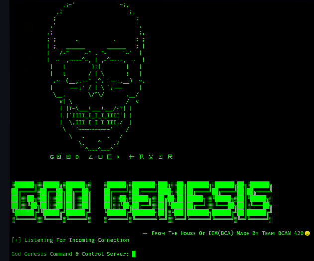

# GodGenesis

<figure><figcaption></figcaption></figure>

Por ahora solo tiene un payload que se puede ejecutar en todas las versiones de Windows el cual puede otorgarnos una sesión de administrador, es una buena opción si queremos tener de manera simplificada todas las sesiones de los equipos que podemos llegar a tener comprometidos.

A mi parecer creo que un C2 sencillo como este debe tener por lo menos una GUI sencilla, mucho más sencilla que Cobalt Strike o Covenant, ¿Qué opináis vosotr@s?

[https://github.com/SaumyajeetDas/GodGenesis](https://github.com/SaumyajeetDas/GodGenesis)

.
